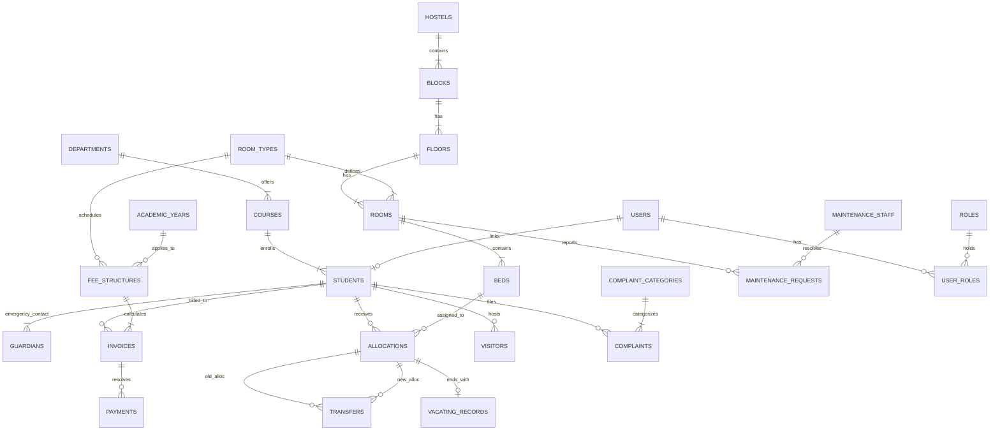

# HostelFlow — Conceptual ER Diagram

**Document ID**: HOSTEL-ERD-001  
**Version**: 1.0  
**Status**: Draft  

This document contains the conceptual entity-relationship diagram for HostelFlow using Mermaid.js syntax.

---

## 1. ER Diagram

---

## 2. Key Cardinality Definitions

* **Hostel structural hierarchy** is strictly one-to-many from Hostels ➔ Blocks ➔ Floors ➔ Rooms ➔ Beds. This hierarchy guarantees that traversing downward from a Bed uniquely identifies its exact room, floor, block, and hostel.
* **Allocations** represents a junction entity mapping the many-to-many relationship between Students and Beds over time, resolving historical residency tracking.
* **Transfers** links two allocation records (old and new) for a single student movement, representing a self-referencing style association resolved through foreign keys.
* **Invoices** are calculated based on the room type fee structure and are associated with a single student, while allowing multiple payment transactions.
