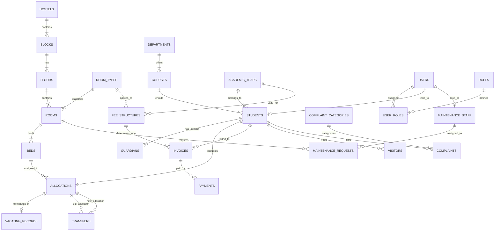

# HostelFlow — Conceptual ER Diagram

**Document ID**: HOSTEL-ERD-001  
**Version**: 2.0  
**Status**: Step 6 Complete — Conceptual ER Diagram Derived from Domain Model  

This document presents the complete conceptual Entity-Relationship Diagram for HostelFlow, derived from the domain modeling steps (Requirements ➔ Use Cases ➔ Entities ➔ Attributes ➔ Relationships ➔ Ambiguity Resolutions).

---

## 1. Conceptual ER Diagram (Mermaid.js)

---

## 2. Key Relationship Definitions

| Relationship | Type | Primary Entity | Foreign Entity | Business Rule / Invariant |
|---|---|---|---|---|
| Hostel Hierarchy | Identifying 1:M | `HOSTELS` ➔ `BLOCKS` ➔ `FLOORS` ➔ `ROOMS` ➔ `BEDS` | Structural hierarchy uniquely locates every bed. Bed count per room is bounded by `ROOMS.capacity` (BR-04). |
| Student Demographics | 1:M | `STUDENTS` | `GUARDIANS` | 1NF normalization for multiple emergency contacts. |
| Bed Allocation | M:N Junction | `STUDENTS` + `BEDS` | `ALLOCATIONS` | State-derived generated keys enforce at most one active bed allocation per student (BR-03) and at most one active resident per bed (BR-02). |
| Transfer Causal Link | 1:M (Self-ref) | `ALLOCATIONS` (old & new) | `TRANSFERS` | Connects historical allocation pairs during student movement (BR-10). |
| Vacating Terminal Record | 1:1 | `ALLOCATIONS` | `VACATING_RECORDS` | Captures clearance status and exit deposit refunds upon stay termination. |
| Invoicing & Payments | 1:M | `INVOICES` | `PAYMENTS` | Financial tracking ensuring payment sum ≤ invoice balance (BR-06). |
| Incidents & Services | 1:M | `STUDENTS` / `ROOMS` | `COMPLAINTS` / `MAINTENANCE_REQUESTS` | Room-level maintenance assignment and student-level complaint lifecycle tracking. |

---

Phase 2 (Domain Modeling) is fully complete across all 6 steps. We are ready to proceed to **Phase 3 — Database Design (Relational Schema & 3NF Normalization)**.
